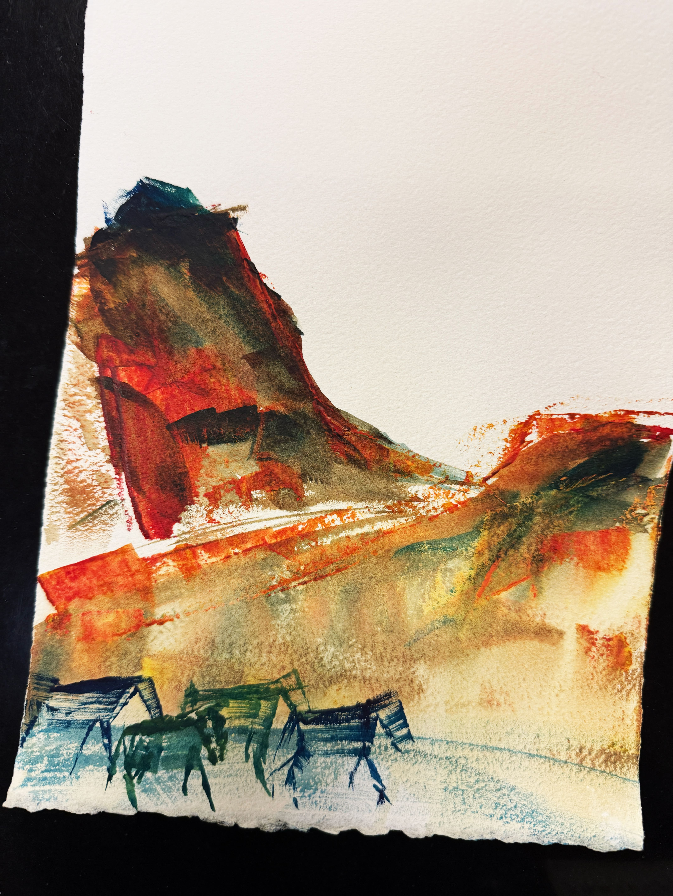

## About Me

I am Yilan Wei, currently a Ph.D. student in Communication Sciences and Disorders at Northwestern University. My academic journey spans three continents: I completed my undergraduate studies at the National Academy of Chinese Theatre Arts in China, earned my master's degree from the University of Groningen in the Netherlands, and am now pursuing my doctoral degree in Chicago, USA. This cross-cultural educational experience has not only enriched my academic perspective but also fostered a deep appreciation for cultural diversity.

My research interests have naturally evolved from arts and humanities to voice technology, and now to neuroscience. During my master's program, I focused on speech synthesis technology, developing an innovative method for multi-effect speech synthesis. Currently, in my doctoral studies, I am using animal models to investigate neurological changes in neonates under hypoxic conditions, applying machine learning techniques to analyze animal behavioral data.

Beyond my academic pursuits, I am passionate about art and travel. As a watercolor and ink painting enthusiast, my collection "Whispers of Spring" was selected for the 2025 Norris Spring Arts and Crafts Fair. My creations draw inspiration from my journeys across nearly 20 countries spanning five continents, blending experiences with imagination.

I look forward to making positive contributions to academia and society through my research and artistic endeavors.

---

## Education

### Ph.D. in Communication Sciences and Disorders

Northwestern University, USA, 2024 - Present

### MSc in Voice Technology

University of Groningen, Netherlands, 2023 - 2024

### BA in Literature of Theatre, Film and Television (International Cultural Communication)

National Academy of Chinese Theatre Arts, China, 2019 - 2023

---

## Art & Travel

My watercolor paintings are poetic dialogues between travel memories and inner visions, where through layered transparent pigments and dancing brushstrokes, I attempt to capture fleeting moments of light and emotion. The vibrant yet tender palette in my works pays homage to nature's grandeur while offering heartfelt interpretations of cultural diversity. My collection "*Whispers of Spring*" was honored to be selected for the 2025 Norris Spring Arts and Crafts Fair. The centerpiece "*Icelandic Wild Horses*" masterfully balances wet and dry watercolor techniques, interweaving galloping horses with vibrant, colorful mountain ranges into a dreamlike visual symphony. This work not only presents the primal forces of Nordic nature but also reflects my inner pursuit of freedom and vitality—a microcosm of my artistic journey where rationality and sensibility, reality and imagination, perfectly converge.

<figure style="text-align: center; margin: 20px auto;">
    
    <figcaption style="margin-top: 10px; font-style: italic; color: #666;">Icelandic Wild Horses (2024)</figcaption>
</figure>

As a passionate traveler, I have journeyed across nearly 20 countries spanning Asia, Europe, Africa, North America, and South America. Each voyage has been an exploration of both mind and culture. From the winding canals and charming windmills of Amsterdam in the Netherlands to the azure icebergs of Jökulsárlón Glacier Lagoon and galloping wild horses of Iceland; from the ancient pyramids and mysterious pharaonic civilization along Egypt's Nile River to the graceful alpacas and awe-inspiring Incan ruins in Peru's Andean mountains—these journeys have allowed me to witness nature's wonders and magnificence while deeply experiencing the rich cultural diversity across the globe.

My passion for travel stems from the opportunity to step outside my comfort zone, experience different ways of life across cultural boundaries, and embrace novel, thrilling experiences. I have fished in Icelandic waters and tasted freshly caught cod, experiencing the bounty of the North Atlantic; at Jökulsárlón (Glacier Lagoon), I've boated up close to genuine icebergs, listening to the sound of thousand-year-old ice breaking off from the Vatnajökull glacier. In Cappadocia, Turkey, I've soared in a hot air balloon over the winding riverbeds below, appreciating the geological masterpieces formed by water erosion over thousands of years. In local markets of Peru, I've explored the mysterious power of witchcraft, connecting with the spiritual world of ancient Andean civilizations.

These colorful travel experiences have not only broadened my horizons but also provided endless inspiration for my artistic creations. Each journey to unfamiliar countries deepens my understanding of the world and enhances my appreciation for different cultures, ultimately becoming integrated into my paintings as the stories and emotions behind each work.
